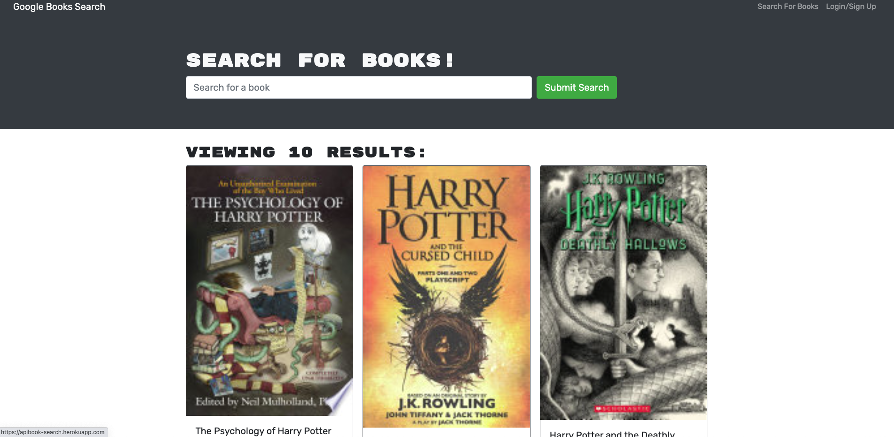

# MERN-BookSearch

  ## Table-of-Contents
  * [Description](#description)
  * [Installation](#installation)
  * [Usage](#usage)
  
    *[License](#license)
    
  * [Contributing](#contributing)
  * [Tests](#tests)
  * [Questions](#questions)
  
  ## Description
  In this project i have a made a Google Api Book Search where you can search for any book and be signed-up or login to save a book if you a have a interest in reading later on. In each Book you see they have each a descption rundown on what the book is on. Also with project i used @apollo/client to have a token when someone is logged in.

  ## [Installation](#table-of-contents)
  just needed for this is npm i for all the packages that is needed and a npm @apollo/client .

  ## [Usage](#table-of-contents)
   Here is the deployed site on heroku: https://apibook-search.herokuapp.com/

   Here is the photo of the deployed site:;

  ## Contributing  
      Thank you for your interest in helping out; however, I will not be accepting contributions from third parties.
      
  ## [Tests](#table-of-contents)
  to deploy it just have to type in the comand line npm run develop .

  ##  [Questions](#table-of-contents)
  Please contact me using the following links:
  [GitHub](https://github.com/bryguy20)
  [Email: bryansegarra044@gmail.com](mailto:bryansegarra044@gmail.com)
